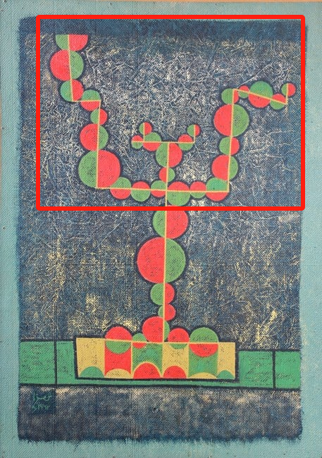

# 9103-YanLi-Work
## Instructions
This project presents an interactive animation controlled by mouse movements. Moving the mouse vertically gradually reveals or hides the circles, while horizontal movements control their rotation direction. Clicking on the upper part of a circle triggers a falling animation.
## Individual approach
### Personal approach and animation driven
For my individual animation, I chose User Input (mouse interaction) as the driving method, based on our group animation framework. The vertical position of the mouse controls how many circles (representing leaves or fruits) appear on the tree, while the horizontal position controls their rotation direction. Additionally, clicking on the upper part of the tree (the canopy) triggers individual fruits to fall to the ground.

My inspiration comes from the symbolic representation of life in Shemza’s work “The Apple Tree”. I wanted users to take part in the growth of the tree—through their mouse movements, they influence the speed of its blooming and the direction it sways. The falling of the fruits back to the soil represents the cyclical nature of life, completing a poetic loop of growth and return.

In terms of animation, I implemented several key techniques to enrich the visual experience:

## Animation properties and technological innovation
To realize the above conceptual inspiration, I modified the group animation’s growth sequence and introduced the following technical innovations to ensure that the final animation aligns with the natural life cycle theme while delivering a unique interactive experience.

1. Growth Driven by Vertical Mouse Movement
Using the function map(mouseY, height * 0.9, height * 0.1, 0, circles.length), the vertical position of the mouse is mapped to the number of visible circles (circleIndex). This enables a bottom-to-top progressive reveal of the apples, simulating the growth of an apple tree.

Compared to a static sequence, this interactive control over "growth speed" enhances immersion. The mapping range—from height * 0.9 to height * 0.1—was carefully tuned to ensure the animation feels both smooth and intuitive.

2. Dynamic Rotation & Directional Control
In updateCircles(), I detect horizontal mouse displacement using dx = mouseX - pmouseX, which updates the global variable mouseXDirection (either 1 or -1). This value controls the rotation direction of the circles.

Each circle’s rotation speed is determined individually via rotatedSpeed, assigned a random value between 1 and 4, ensuring variation and avoiding visual monotony.

Unlike fixed clockwise/counter-clockwise motion, the direction here responds to real-time user input, increasing the freedom and responsiveness of interaction.

3. Physics-Based Falling Effect
In mousePressed(), the distance between the mouse click and each circle’s center is calculated using dist(). If the click falls within a circle's bounds and its index > 8 and rotation is activated, a new SplitCircle is created to simulate the falling effect.

This falling object is driven by physics and flagged with hasFallen = true, applying the following:

Gravity: In the update() method, this.vy += this.gravity (gravity = 0.6) simulates vertical acceleration.

Initial Horizontal Velocity: On the first frame of falling, this.vx = random(0.1, 1) * dir introduces randomized horizontal movement based on user drag direction (wind-like side motion).

Damping: Upon ground contact, this.vy *= -this.damping (damping = 0.8) reverses and slows the bounce; meanwhile, this.vx *= 0.95 gradually reduces horizontal speed.

Stop Detection: When abs(this.vy) < 1, the object is marked isStopped = true, and this.stoppedTime = millis() / 1000 is recorded to later trigger disappearance.

This system produces a visually and physically realistic falling experience, in contrast to simplistic tween animations. The falling circles are tracked via a dedicated fallenCircles[] array to avoid interfering with the main circles[], improving modularity.

4. Collision Detection & Boundary Handling
Ground Collision:
In update(), the circle’s position is calculated via
xpos = this.nx * width, ypos = this.ny * height, and radius = this.nRadius * width.
A collision is detected when ypos + radius > floor (floor = height * 0.81).

Handling:
On collision, ypos = floor - radius is applied to prevent penetration through the floor. The vertical speed is inverted and damped (this.vy *= -this.damping) to simulate a realistic bounce.

Visual Alignment:
The floor height aligns visually with the lower colored grid area (cornerY = height * 0.76), ensuring a consistent aesthetic between animation and layout.

5. Lifecycle & Disappearance
After falling and stopping, each fruit uses its stoppedTime to trigger a delayed disappearance:
if (millis()/1000 - this.stoppedTime > 2) → this.isDead = true.

This combines physical behavior with temporal decay, representing the symbolic process of a fruit returning to the soil. The ephemeral lifespan of each circle poetically mirrors the life-cycle theme of Shemza’s “The Apple Tree.”

